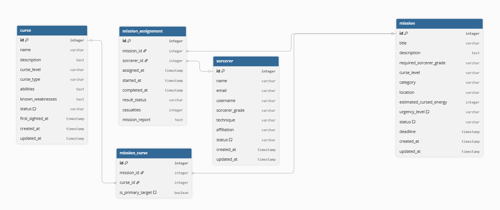

# JJK Mission Mailer

Sistema de gerenciamento de missões para feiticeiros (Jujutsu Kaisen).

## Requisitos

- Docker e Docker Compose
- PHP 8.2+ (para desenvolvimento local)
- Composer

## Instalação

```bash
# Clone o repositório
git clone <repo-url>
cd jjk-mission-mailer

# Copie o arquivo de ambiente
cp .env.example .env

# Instale as dependências
composer install

# Suba os containers
make up

# Execute as migrations e seeders
make migrate-fresh
make seed
```

## Executando a Aplicação

### Subir os containers

```bash
make up
```

### Parar os containers

```bash
make down
```

## Serviços

| Serviço             | URL                                | Descrição                |
| ------------------- | ---------------------------------- | ------------------------ |
| API                 | http://localhost                   | Aplicação Laravel        |
| Swagger UI          | http://localhost/api/documentation | Documentação da API      |
| Swagger UI (Docker) | http://localhost:8080              | Documentação alternativa |
| Mailpit             | http://localhost:8025              | Visualização de emails   |
| PostgreSQL          | localhost:5432                     | Banco de dados           |
| Redis               | localhost:6379                     | Cache e filas            |

## Filas (Redis)

O sistema usa Redis para processar jobs em background, como envio de emails.

### Iniciar o worker de filas

```bash
make queue
```

Ou com auto-restart em mudanças de código:

```bash
make queue-listen
```

**Importante:** O worker precisa estar rodando para que os emails sejam enviados quando você usar os endpoints `/mission/assign` ou `/mission/notify-all`.

## Emails (Mailpit)

O Mailpit captura todos os emails enviados pela aplicação em ambiente de desenvolvimento.

### Acessar o dashboard

Abra http://localhost:8025 no navegador para ver todos os emails enviados.

## Documentação da API (Swagger)

### Acessar

- http://localhost/api/documentation

### Regenerar após alterações

```bash
make swagger
```

## Comandos Úteis

```bash
make help          # Lista todos os comandos disponíveis
```

## Estrutura do Banco de Dados


